# WMPFDebugger + AI_JS_DEBUGGER Integration Architecture

This document provides detailed architectural diagrams for the integration between WMPFDebugger and AI_JS_DEBUGGER.

## System Architecture

## Data Flow: XHR Breakpoint Mode

## Component Communication

## Setup Flow

## Key Integration Points

### 1. CDP WebSocket Connection
- **WMPFDebugger exposes**: `ws://127.0.0.1:62000` (default)
- **AI_JS_DEBUGGER connects to**: Same WebSocket endpoint
- **Protocol**: Standard Chrome DevTools Protocol (CDP)

### 2. Hook Injection
- **Frida hooks**: Injected by WMPFDebugger into WMPF process
- **JS hooks**: Injected by AI_JS_DEBUGGER via CDP Runtime.evaluate
- **Target**: Crypto functions (AES, RSA, etc.)

### 3. Data Extraction
- **Breakpoints**: Set via CDP Debugger.setBreakpoint
- **Variable inspection**: Via CDP Runtime.getProperties
- **Call stack**: Via CDP Debugger.getStackTrace
- **Network data**: Via CDP Network domain events

### 4. AI Analysis Pipeline
1. Collect debugging context (code, variables, call stack)
2. Extract encryption parameters (keys, IVs, algorithms)
3. Send to AI model with analysis prompt
4. Parse AI response for insights
5. Generate human-readable report
6. Optionally generate mitmproxy script

## Security Considerations

```mermaid
flowchart LR
    subgraph Safe["✅ Safe Operations"]
        S1["Read-only debugging"]
        S2["Local connections only"]
        S3["No network sniffing"]
    end
    
    subgraph Sensitive["⚠️ Sensitive Data"]
        T1["Encryption keys"]
        T2["User credentials"]
        T3["API tokens"]
    end
    
    subgraph Protection["🔒 Protections"]
        P1["Store API keys securely"]
        P2["Don't commit config files"]
        P3["Use for authorized testing only"]
    end
    
    S1 -.->|may access| T1
    S1 -.->|may access| T2
    S1 -.->|may access| T3
    
    T1 -->|requires| P1
    T2 -->|requires| P1
    T3 -->|requires| P1
    
    P1 --> P2
    P2 --> P3
    
    style Safe fill:#e8f5e9
    style Sensitive fill:#ffebee
    style Protection fill:#e3f2fd
```

## Troubleshooting Decision Tree

## Performance Considerations

| Component | Resource Usage | Optimization Tips |
|-----------|---------------|-------------------|
| **WMPFDebugger** | Low CPU, ~100MB RAM | Keep frida hooks minimal |
| **Frida Hook** | Minimal overhead | Avoid hooking hot paths |
| **CDP Proxy** | Network I/O bound | Use local connections only |
| **AI_JS_DEBUGGER** | Medium CPU, ~500MB RAM | Limit concurrent sessions |
| **AI API Calls** | Network latency | Use faster models for iteration |
| **Hook Injection** | JavaScript overhead | Selective hook injection |

## Limitations and Workarounds

| Limitation | Impact | Workaround |
|------------|--------|------------|
| WMPF version specific | May not work with all versions | Check supported versions in README |
| Single miniapp debugging | Can't debug multiple simultaneously | Use multiple ports/instances |
| Anti-debug detection | Some miniapps may detect debugging | Try different hook strategies |
| AI model dependency | Analysis quality varies | Use GPT-4 or Claude for best results |
| Network encryption | Additional layers may obscure data | Combine with network proxy tools |
| Performance impact | Debugging slows execution | Use selective breakpoints |

---

For implementation details and usage instructions, see [AI_INTEGRATION.md](AI_INTEGRATION.md).
